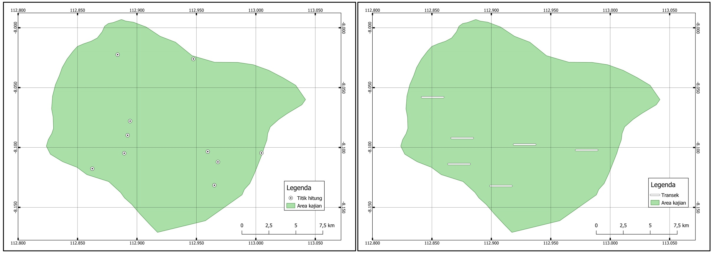

# Rancangan Survei {-}

Beragam teknik dalam mencuplik satwa liar sudah banyak dibahas dalam berbagai panduan (Bookhout, 1994; Elzinga et al., 2009). Dalam panduan ini kami hanya menyimpulkan sebagian yang sering dipergunakan dalam ruang lingkup kerja FFI\`s IP. Secara umum teknik ini dibagi dalam dua hal dalam koleksi datanya, yaitu secara observatif atau perjumpaan langsung dan penangkapan. Konteks penangkapan dalam hal ini tidak hanya terbatas menangkap satwanya tapi juga dalam media gambar dan suara (tabel \@ref(tab:tab1)).

```{r cftb, include=FALSE}
library(flextable)
library(readr)
library(tidyverse)
ragamtd <- read_delim("src/ragametode.csv", 
    delim = ";", escape_double = FALSE, trim_ws = TRUE)
myti <- flextable(ragamtd) %>%
  italic(part = "body", j = "Metode") %>%
  merge_v(j = ~ Teknik + Rujukan ) %>%
  theme_vanilla() %>% 
  autofit() 
```

```{r ragamtd, echo=FALSE, ft.align="center", label='tab1', tab.cap='Ragam metode survei dan target organisme', tab.id='tab1'}
myti
```

Setiap metode yang digunakan dalam tabel \@ref(tab:tab1) membutuhkan *Standard sampling unit* (SSU) / unit cuplik, yaitu suatu kelompok pengamatan atau data yang dikumpulkan secara independen berdasarkan metode yang terdefinisi dengan jelas dan dilakukan berulang-ulang. SSU biasanya menggambarkan jumlah sampel (N) dalam tes statistik. Unit cuplik harus konsisten sepanjang studi berlangsung. Sebagai contoh; jika unit cuplik yang digunakan adalah plot sirkular untuk pengamatan burung dengan radius pengamatan 50 meter, maka plot lainnya harus dengan radius yang sama. Dalam melakukan pencuplikan (sampling), asumsi dasar yang harus dipenuhi adalah cuplikan itu mampu menggambarkan keseluruhan area yang disurvei. Oleh karena itu, jumlah sampel yang diambil harus cukup banyak untuk dapat dijadikan perwakilan area.

Salah satu cara yang dapat digunakan untuk memaksimalkan ukuran sampel adalah pengulangan / replikasi. Replikasi pada dasarnya adalah melakukan pengambilan secara berulang atau beberapa kali di dalam *SSU*. Replikasi mengurangi bias dalam pengamatan, sebagai contoh; Jika pengamatan dilakukan hanya 1 kali di suatu plot, besar kemungkinan akan banyak spesies yang luput dari pengamatan, namun jika pengamatan dilakukan selama beberapa hari, besar kemungkinan akan banyak temuan spesies baru dibandingkan hari sebelumnya.

Seringkali analisa statistik dalam kajian satwa liar juga membutuhkan sejumlah data yang cukup banyak. Sebagai contoh; Jika kita memasang 1 kamera jebak selama 1 malam untuk menangkap gambar rusa (dalam statistik ukuran sampel tersebut adalah N=1), dan pada malam itu tidak tertangkap rusa sama sekali, belum tentu dikawasan tersebut tidak terdapat rusa (*false-absence*), sebaliknya jika 10 unit kamera jebak dipasang selama 1 malam (N=10) dan 5 diantaranya menangkap gambar rusa, kita juga belum bisa mengambil kesimpulan, bahwa hanya 5 area yang dihuni oleh rusa. Jika 30 kamera jebak dipasang pada kawasan hutan dan masing-masing aktif selama 30 hari (N=900), maka kita mungkin baru bisa mengambil kesimpulan yang lebih akurat dan presisi. Penggunaan statistik dapat memberikan tingkat keyakinan terhadap keputusan yang kita ambil berdasarkan jumlah unit cuplik yang digunakan.

## Penentuan peletakan lokasi unit cuplik {-}

Rancangan peletakan lokasi unit cuplik harus dapat menggambarkan keseluruhan lokasi secara umum, oleh karena itu harus disesuaikan dengan tujuan studi dan kondisi habitat. Metode-metode penentuan lokasi tersebut diantaranya adalah *purposive, random, dan stratified*.

### *Purposive sampling* {-}

Metode ini dikenal juga dengan *judgemental selective*, artinya penempatan unit cuplik dipilih secara langsung berdasarkan subjektivitas peneliti dengan pertimbangan tertentu, misalnya area dimana keberadaan jenis telah diketahui. Metode ini umumnya bersifat kualitatif dan tidak melibatkan pengolahan statistik karena setiap titik cupliknya diperlakukan berbeda, atau tidak semua titik di dalam populasi cuplik memiliki peluang untuk dipilih. Metode ini baik diaplikasikan untuk pendataan jenis dimana lokasi keberadaan jenis telah diketahui atau diperkirakan. Contoh dari purposive sampling ini diantaranya pemilihan sungai untuk survey katak. Sungai dipilih dengan pertimbangan bahwa sungai sebagai habitat katak akan memberikan probabilitas perjumpaan yang lebih besar dibanding kawasan lainnya.

### *Random sampling* {-}

Pada metode ini, penempatan unit cuplik ditetapkan secara acak di dalam batas-batas area yang telah ditetapkan sebelumnya. Asumsi yang digunakan pada metode ini adalah bahwa setiap titik memiliki probabilitas yang sama untuk dipilih, sehingga semakin banyak titik yang dicuplik akan semakin mewakili populasi area. Metode ini baik diaplikasikan pada area survey dimana sebaran populasi cenderung normal dan memiliki kondisi habitat yang realtif homogen, contohnya survey burung di area hutan dengan tipe habitat yang seragam.

```{r sandomsampling, echo=FALSE, out.width = '100%',fig.align='center',fig.cap='Ilustrasi peletakan unit cuplik secara acak (random) [kiri] titik hitung [kanan] transek'}

```

### *Stratified sampling* {-}

Stratifikasi umumnya digunakan untuk membatasi sebaran populasi cuplik dimana terdapat perbedaan tipe habitat di dalam area survei. Asumsi yang diambil adalah bahwa tipe habitat yang berbeda cenderung memberikan keterwakilan populasi yang berbeda secara signifikan.

Langkah pembagian strata paling mudah adalah dengan melihat kategori tutupan lahan atau tipe habitat sehingga akan didapat sejumlah strata sebanyak tipe habitat yang ada. Di masing-masing strata kemudian dilakukan pemilihan unit cuplik secara acak. Dengan demikian, setiap strata memiliki keterwakilan cuplik yang setara

Meski demikian, jumlah pembagian unit cuplik disetiap strata bergantung pada prinsip variabilitas spesies. Sebagai contoh: [i] Hutan sekunder alami cenderung memiliki kekayaan jenis lebih tinggi dibandingkan dengan perkebunan, sehingga jumlah unit cuplik dikawasan hutan harus lebih banyak dibandingkan di perkebunan. [ii] Sebaliknya, apabila kita membandingkan dua strata yang belum diketahui variabilitasnya seperti hutan sekunder dataran rendah dan hutan sekunder dataran tinggi maka jumlah unit cupliknya diupayakan sama.

```{r randomstrat, echo=FALSE, out.width = '100%',fig.align='center',fig.cap='Ilustrasi peletakan unit cuplik menggunakan strata (stratified)'}
knitr::include_graphics("images/randomstrat.jpg")
```

Konsep stratifikasi juga bisa dilakukan paska survei, sebagai contoh jika transek atau plot yang digunakan sama antara vegetasi dan fauna. Kemudian, hasil survei vegetasi menemukan bahwa terdapat area dengan kepadatan biomasa yang signifikan berbeda atau memiliki area dengan kelompok tipe vegetasi yang berbeda secara signifikan. Maka analisa untuk fauna bisa dikelompokan sesuai dengan strata dari analisa vegetasi tersebut.

## Bentuk dan jumlah unit cuplik {-}

Unit cuplik yang sering dipergunakan oleh FFI\`s IP untuk kajian biodiversitas adalah transek sepanjang 2 km untuk mamalia dan herpetofauna dengan kombinasi kuadrat plot untuk tumbuhan dan plot sirkular untuk burung disepanjang transek tersebut. Satu unit cuplik dengan desain tersebut dapat mencakup 2 ha untuk mamalia dan herpetofauna, 1,25 ha untuk vegetasi, serta 4.8 ha untuk burung.

Jumlah unit cuplik disesuaikan dengan ketersediaan sumber daya yang ada. Dalam survei biodiversitas, tidak ada jumlah minimum yang pasti, namun umumnya peneliti mengevaluasi kecukukupan jumlah unit cuplik dari kurva akumulasi spesies paska survei selesai. Oleh karena itu penting untuk melihat referensi pada penelitian lain untuk menentukan jumlah unit cuplik yang sesuai pada karakteristik habitat atau lokasi yang sama sebelum survei dimulai.

Pendekatan lain yang dapat digunakan untuk menentukan jumlah unit cuplik minimum adalah menggunakan metode yang dikembangkan oleh [Winrock International](https://winrock.org/document/winrock-sample-plot-calculator-spreadsheet-tool/), dengan memasukan luas setiap strata, ukuran plot dan nilai estimasi rerata kandungan biomassa pada tipe habitat serupa. *Tools* tersebut sering digunakan dan diakui untuk kajian dan monitoring proyek-proyek restorasi.

## Pembuatan transek {-}

Setelah penentuan letak dan jumlah unit cuplik ditentukan, langkah selanjutnya sebelum melakukan survei adalah pembuatan jalur transek. Pembuatan jalur ini dilakukan minimal seminggu sebelum survei biodiversitas dimulai, dengan cara menyiangi tutupan bawah hutan sehingga membentuk jalur jalan yang lurus. Hal ini bertujuan agar satwa yang menghuni habitat tersebut dapat beradaptasi dengan jalur transek yang sudah dibuat. Pembuatan transek juga berfungsi agar tim survei biodiversitas dapat lebih fokus dalam mengamati satwa, serta berpindah tempat tanpa harus membuka jalan yang terutup oleh semak.

### Persiapan Tim {-}

Jumlah total anggota tim yang dibutuhkan untuk membuat jalur transek idealnya adalah 5 orang dengan tugas yang berbeda-beda. Tabel \@ref(tab:tabtranstim) menjelaskan jumlah dan tugas anggota tim yang terlibat dalam proses pembuatan transek:

| Peran       | Tanggung jawab                                                                            | Syarat khusus                                  |
|:---------------------|:----------------------------|:---------------------|
| Penebas I   | Penebas utama untuk membuka jalur                                                         | Tidak ada                                      |
| Penebas II  | Penebas kedua untuk melebarkan jalur                                                      | Tidak ada                                      |
| Penebas III | Penebas ketiga untuk merapihkan jalur                                                     | Tidak ada                                      |
| Navigator   | Menunjukan arah jalan dan lokasi transek, pemasang pita penanda dan merekam jalur transek | Mampu melakukan navigasi dengan kompas dan GPS |
| Logistik    | Pengaturan logistik selama pembuatan transek                                              | Terampil dalam pengaturan logistik             |

: (#tab:tabtranstim) Peran dan tanggung jawab tim transek

Peralatan yang dibutuhkan dalam pembuatan transek dapat dilihat di Tabel \@ref(tab:tabaltrans)

| Peralatan        | Jumlah   |
|:-----------------|:---------|
| Parang tebas     | 3 unit   |
| Kompas orientasi | 1 unit   |
| GPS              | 1 unit   |
| Pita penanda     | 1 gulung |
| Batu asah        | 3 unit   |

: (#tab:tabaltrans) Peralatan yang dibutuhkan tim pembuatan transek

### Langkah kerja {-}

-   Anggota tim yang bertanggung jawab memegang kompas mengarahkan sudut pembuatan transek agar senantiasa lurus.

-   Penebas utama menebas semak dan ranting untuk membuka jalan

-   Penebas kedua dan ketiga melebarkan jalan hingga kira-kira selebar 1,5 - 2 meter.

-   Navigator selain merekam jalur dengan GPS, juga menandai area yang sudah dibuka dengan pita tagging setiap 50 meter pada ranting pohon.

-   Navigator juga disarankan untuk mencatat temuan lain ke dalam GPS, fitur yang mungkin dapat digunakan oleh tim survei kehati, seperti: Sumber air, persimpangan, lokasi kamp ideal, lokasi dengan konsentrasi biodiversitas yang tinggi dan lainnya.
