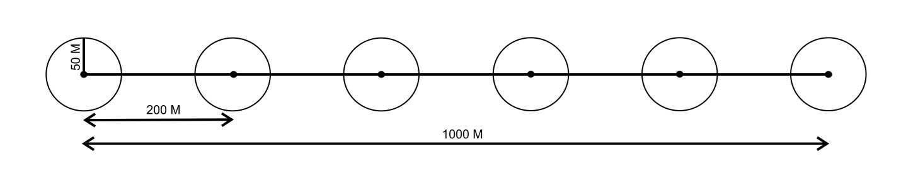

# Protokol Survei {-}

## Avifauna {-}
Pengamatan burung atau avifauna yang biasa dilakukan oleh FFI`s IP mengadopsi dua metode utama yaitu metode titik hitung di transek (_Point transect_) (Buckland, 2006) dan daftar jenis MacKinnon (_Mackinnon lists_) (MacKinnon & Phillipps, 1993). Pada dasarnya metode point transect merupakan modifikasi dari metode titik hitung, namun unit sampelnya berada dalam transek yang sudah ditetapkan, metode ini efektif digunakan pada hutan tropis, dimana jalurnya seringkali sulit untuk dilalui dan burung menghuni seluruh strata hutan dari permukaan tanah hingga diatas tajuk. Dengan fokus pada titik tertentu di dalam transek, deteksi burung jadi lebih efektif. Pada Mackinnon lists survei dilakukan bisa di jalur transek atau pun di luar transek. Kedua metode ini saling melengkapi dalam pengumpulan data jenis-jenis burung

### Persiapan Tim {-}
Tim avifauna idealnya terdiri dari 2 orang, yaitu pengamat utama dan asisten lapangan. Dengan peran dan tanggung jawab yang  terangkum dalam tabel \@ref(tab:tbta).

Table: (\#tab:tbta) Peran dan tanggung jawab tim avifauna

| Peran | Tanggung jawab  | Syarat khusus |
|:--|:------|:------|
| Pengamat utama | Mengamati dan mengidentifikasi burung pada lokasi yang disurvei, kemudian memberikan informasi pada pencatat mengenai data yang dibutuhkan seperti yang tertera pada lembar data | Memahami protokol serta identifikasi jenis burung dan penggunaan peralatan pendukung survei|
| Asisten lapangan | Mencatat data temuan survei dan juga sebagai pencatat waktu (_time keeper_) | Memahami protokol survei avifauna dengan baik |

### Peralatan {-}

Table: (\#tab:tbpa) Peralatan yang dibutuhkan tim avifauna

|  Peralatan | Tujuan Penggunaan | Spesifikasi |
|:--|:------|:------|
|  Alat Tulis | Pencatatan data dan penandaan | Kuat, tidak mudah luntur | 
|  Lembar data | Lembar pencatatan data | Tahan air | 
|  Alat Navigasi (GPS, Peta dan Kompas) | Untuk navigasi sekaligus penanda lokasi geografis | Tahan air | 
|  Binokuler | Untuk melihat dan mengidentifikasi burung | Perbesaran lensa minimal 8 x 40 atau 7 x 50 | 
|  Kamera | Untuk dokumentasi burung dan identifikasi lebih lanjut | DSLR dengan lensa tele 300 – 400 mm. Alternatif lainnya dapat menggunakan kamera digital _prosummer_ dengan perbesaran optik diatas 30x | 
|  Perekam suara genggam | Merekam suara burung untuk identifikasi lebih lanjut | Perekam suara digital dengan fitur _directional microphone_  |
|  Perekam suara pasif | Merekam suara burung untuk identifikasi burung yang sensitif | Tahan air. Perangkat yang biasa digunkan adalah _audiomoth_ (Hill et al., 2019) |

### Protokol Pengamatan{-}
#### Titik hitung{-}
Protokol untuk survei dengan metode titik hitung dalam transek yang dilakukan oleh FFI`s IP menggunakan enam buah titik hitung dengan rentang antar titik berjarak 200m sehingga akan membentuk garis transek sejauh 1 Km (Gambar \@ref(fig:figpc)). Radius pengamatan per titik adalah 50m dari titik pusat. Titik pusat yang dimaksud adalah titik yang telah ditentukan. Pengamatan menggunakan titik hitung mengikuti asumsi-asumsi berikut ini: 

1.	Burung tidak mendekati pengamat atau terbang;
2.	Burung yang ada dalam titik cuplik dapat terdeteksi 100%;
3.	Burung tidak bergerak selama perhitungan;
4.	Burung berperilaku bebas (tidak tergantung satu sama lain);
5.	Pelanggaran terhadap asumsi tersebut tidak berpengaruh terhadap habitat atau desain studi;
6.	Estimasi jarak akurat;
7.	Burung dapat teridentifikasi dengan baik seluruhnya.

Dalam pelaksanaannya, pengamat berhenti pada suatu titik pengamatan selama 20 menit untuk mengamati dan mencatat jenis burung yang dapat diidentifikasi di sekitar lokasi penelitian. Setelah 20 menit, pengamat kemudian berpindah ke titik pengamatan lain dan kemudian melakukan pengamatan lagi di titik pengamatan tersebut dengan waktu yang sama yaitu selama 20 menit. Jumlah titik pada setiap jalur adalah enam titik, dengan jarak masing-masing titik 200 m, sehingga panjang jalur pengamatannya adalah 1 km. Pengamatan dilakukan pada pagi hari pukul 06.00-09.00 WIB dan sore hari pukul 15.30-18.00 WIB. Perjumpaan terhadap jenis burung di luar titik pengamatan tidak diperhitungkan. Pada setiap jalur pengamatan dilakukan pengulangan pengamatan sebanyak dua kali. Pengamatan dilakukan melalui perjumpaan langsung dengan objek (visual) dan melalui suara.  Parameter yang dicatat adalah jenis burung, jumlah yang ditemukan dan aktifitas. Jika memungkinkan, maka jarak setiap burung yang dijumpai terhadap pengamat juga diukur, dengan data seperti itu maka kepadatan burung juga dapat dihitung dengan konsep distance sampling (Buckland et al., 2015).

```{r figpc, echo=FALSE, out.width = '100%',fig.align='center',fig.cap='Ilustrasi titik hitung di transek'}

```

**Cara Pelaksanaan :**
1. Sebelum menuju ke titik hitung, pengamat sudah menentukan lokasi titik – titik hitung tersebut di GPS.
2. Pengamat menuju titik yang sudah ditentukan di dalam transek, dimana jarak antar point sepanjang 200 meter.
3. Setiap titik ditandai di dalam GPS
4. Pengamat berdiri di titik tengah dari point yang sudah ditentukan.
5. Pengamat mengamati dan mencatat burung yang terdengar ataupun terlihat selama 20 menit ke dalam lembar pengamatan titik hitung (Gambar \@ref(fig:ldpth))
6. Untuk penggunaan perekam suara, bisa digunakan selama 20 menit pengamatan atau ketika mendengar suara-suara yang menarik.
7. Asisten dapat membantu mengukur parameter lingkungan disekitar lokasi pengamatan selama durasi pengamatan kedalam lembar data parameter lingkungan (Gambar \@ref(fig:ldppl)) secara semi-kuantitatif.

#### Daftar jenis MacKinnon {-}
Metode ini pada dasarnya membuat sejumlah daftar yang berisi catatan nama jenis-jenis burung yang dijumpai untuk mendapat gambaran cepat mengenai kekayaan dan komposisi jenis burung pada suatu wilayah. Rincian prosedur penyusunan daftar dijelaskan di bawah ini.

**Cara Pelaksanaan:**
1. Berjalan di suatu habitat, seperti perjalanan dari desa menuju camp, di sekitar camp, dari camp menuju transek, transek satu kilo diluar point dan ketika perjalanan dari point menuju point yang lain dan mencatat semua jenis burung yang dijumpai sampai tercatat 20 jenis burung dalam satu daftar. Satu jenis burung hanya dicatat satu kali saja dalam satu daftar ini, meskipun dijumpai beberapa kali

2. Setelah tercatat 20 jenis burung, lalu membuat daftar yang baru untuk mencatat jenis-jenis yang dijumpai selanjutnya (daftar no.2). Apabila dijumpai jenis yang pernah tercatat dalam daftar pertama maka tetap dicatat dalam daftar kedua, tetapi sebagaimana dalam pembuatan daftar pertama, jenis yang sudah dicatat dalam daftar kedua tidak boleh dicatat lagi meskipun dijumpai beberapa kali (di dalam satu daftar tidak boleh ada pengulangan jenis). Jika suatu spesies ditemukan kembali dalam 1 daftar yang belum mencapai 20 spesies, maka spesies tersebut hanya dihitung sebagai tambahan populasi pada spesies yang sama (bukan spesies baru)

3. Jika menemukan spesies yang menarik maka di tandai posisinya di dalam GPS, begitu juga jika mendengar suara yang menarik maka bisa di rekam di perekam suara.

Metode ini meskipin sederhana, namun membutuhkan pengetahuan yang baik terhadap ekologi dan perilaku burung-burung di area survei. Terkadang pengamat boleh untuk duduk bersembunyi sebentar saat berada habitat yang sedang berbuah dan berbunga untuk melihat dan mendengar burung-burung yang berkunjung. Lampiran Gambar \@ref(fig:ldpml), merupakan contoh lembar data untuk metode daftar jenis MacKinnon.

#### Perekam suara pasif{-}
Untuk melengkapi daftar jenis burung-burung yang mungkin terlalu sensitif terhadap keberadaan manusia / pengamat, maka penggunaan perekam suara dapat dijadikan alternatif karena mampu merekam tanpa kehadiran pengamat selama waktu yang dibutuhkan dan tidak akan ada bias dalam identifikasi karena memiliki data suara yang terdokumentasikan dengan baik. Dalam praktiknya, FFI`s IP seringkali menggunakan perangkat perekam suara _audiomoth_ untuk merekam suara burung-burung di hutan. 

Perekam suara dapat ditempatkan disetiap titik hitung sebagai data pelengkap atau lokasi spesifik lainnya yang diperkirakan memiliki kelimpahan burung dengan jarak minimal antar perekam suara 250 - 1000 meter. Setiap perekam suara diaktifkan minimal 1 x 24 jam agar burung diurnal dan nokturnal dapat terekam. Prinsipnya semakin lama di aktifkan maka data yang diperoleh semakin baik, perangkat ini dapat diaktifkan hingga sekitar 10 hari dengan baterai tipe alkalin dengan pengaturan 5 menit merekam dan 30 menit jeda. Adapun protokol penggunaan perekam suara adalah sebagai berikut;

1. Melakukan pengaturan perangkat dengan spesifikasi sebagai berikut 
   * Sample rate; 48 Khz
   * Gain; Medium
   * Sleep duration; 1800s
   * Recording duration; 300s 

2. Pastikan pengaturan sudah sesuai dengan yang kita inginkan, dengan melakukan simulasi terlebih dahulu

3. Beri label pada setiap perangkat untuk membedakan antar perekam suara

4. Bungkus perangkat dengan plastik atau penutup kedap air dan pasang pada batang pohon dengan ketinggian sekitar 2 meter.

5. Catat kordinat pemasangan, waktu mulai dan waktu berakhirnya pada lembar pengamatan

## Herpetofauna {-}
Survei herpetofauna biasanya didasarkan pada tujuan untuk mendapatkan informasi mengenai:

1. Daftar jenis herpetofauna pada suatu lokasi
2. Densitas atau kelimpahan relatif pada suatu lokasi
3. Penyebaran jenis
4. Aspek spesifik pada satu jenis seperti penggunaan habitat, pola aktifitas, biologi, reproduksi, dan sebagainya

Perbedaan tujuan survei berpengaruh terhadap metode yang digunakan, usaha (effort), biaya dan waktu. Untuk survei yang bertujuan memperoleh daftar jenis, untuk memperoleh sebanyak mungkin jenis pada suatu lokasi perlu dilakukan pencarian aktif dan jebakan (pasif) dengan waktu yang mencakup siang dan malam hari. Hasil survei juga tergantung pada kondisi cuaca dan musim. Terdapat beberapa kendala dalam survei daftar jenis, diantaranya lama pengamatan yang mempengaruhi hasil temuan, biaya dan efektifitas kerja.  Perbandingan hasil survei baik pada lokasi yang sama ataupun berbeda, perlu memperhatikan usaha (effort), musim dilakukan survei, dan metode yang digunakan

Metode yang biasa digunakan oleh FFI`s IP adalah pencarian langsung dengan metode Survei Perjumpaan Visual (Visual Encounter surveis - VES) (Gambar \@ref(fig:figves)). Metode ini dilakukan dengan menyusuri area atau habitat herpetofauna dengan batasan waktu tertentu. Pencarian herpetofauna difokuskan pada tipe jenisnya, pencarian di tajuk pohon, batang dan ranting untuk jenis arboreal, kemudian pencarian di balik serasah, batu, kayu lapuk untuk jenis terestrial, terdapat juga jenis yang hidup di dalam tanah (fosorial) dan perairan seperti sungai, danau, dan kolam.

Metode VES memiliki batasan waktu pencarian di luar waktu penangkapan dan pencatatan. Penentuan batas waktu total biasanya 2 jam per orang per pengambilan sampel. Metode ini dapat dilakukan pada jalur transek, plot petak, aliran sungai, kolam dan lainya. Metode diterapkan dengan melakukan survei lokasi pengamatan dengan menentukan lokasi pengamatan yang memiliki dugaan habitat herpetofauna, membuat sedikit jalur untuk memudahkan pengamatan malam hari dan memberi tanda pada lokasi. Data yang dikumpulkan adalah ukuran lokasi, karakteristik habitat berupa vegetasi dominan, kerapatan tajuk, kondisi fisik lokasi dan dokumentasi lokasi. 

```{r figves, echo=FALSE, out.width = '100%',fig.align='center',fig.cap='Desain VES dalam transek dengan panjang 1 km dan lebar kiri – kanan transek adalah 5 - 10 m.'}
knitr::include_graphics("images/ves_ilustration.jpg")
```

**Persiapan**
Langkah awal sebelum melakukan survei salah satunya adalah pengumpulan informasi terkait lokasi survei dan data dasar pada lokasi. Informasi lokasi survei yang dimaksud antara lain, status administrasi, letak dan aksesibilitas lokasi survei. Sedangkan informasi data dasar berupa peta lokasi, data hasil survei sebelumnya dan data pendukung lain yang diperlukan. Informasi tersebut dapat diperoleh secara langsung kepada pengelola lokasi survei atau melalu lembaga yang menyediakan informasi terkait.

### Persiapan Tim {-}
Tim herpetofauna idealnya terdiri dari 3 orang, yaitu seorang pencatat, pencari atau pengamat, dan asisten lapangan (Tabel \@ref(tab:tabtmh)). Namun pada kondisi tertentu, survei dapat dilakukan oleh 2 orang saja dengan konsekuensi seorang pencatat berperan juga menjadi spotter pada saat yang sama.

Table: (\#tab:tabtmh) Peran dan tanggung jawab tim herpetofauna

| Peran | Tanggung jawab  | Syarat khusus |
|:--|:------|:------|
| Peneliti utama; Pengamat (_Spotter_) | Mencari herpetofauna pada lokasi yang disurvei, mengambil foto dari individu herpetofauna, kemudian memberikan informasi pada pencatat mengenai data yang dibutuhkan seperti yang tertera pada lembar data | Memahami protokol serta identifikasi jenis dan penggunaan peralatan pendukung survei |
| Asisten I: Pencatat | Mencatat data temuan survei dan juga sebagai pencatat waktu (_time keeper_) | Memahami protokol survei herpetofauna dengan baik |
| Asisten II: Penunjuk jalan | Porter atau penunjuk jalan saat survei dan membantu pencarian herpetofauna | Memahami area survei dan kemampuan membaca jalur |

### Peralatan {-}
Peralatan survei yang dipersiapkan disesuaikan dengan waktu, metode dan jumlah surveior. Menyusun daftar peralatan perlu pengelompokan sesuai fungsi untuk mempermudah persiapan, secara umum disusun sebagai berikut:

Table: (\#tab:tbph) Peralatan yang dibutuhkan tim herpetofauna

|  Kelompok | Alat | 
|:--|:------|
|  Navigasi | GPS, kompas, dan peta |
|  Survei dan koleksi data | Senter kepala (_headlamp_), jam tangan, penggaris, meteran, plastik sampel, kantong kain, kamera, alat tulis, lembar data, Sepatu boot| 
|  Preservasi | Kotak specimen, kain kasa, syringe, alat bedah, kertas label, benang, gunting, alkohol, formalin, toples spesimen | 

**Baterai**
Alat-alat seperti _headlamp_, GPS dan Kamera. Kalkulasikan kebutuhan baterai tersebut sebelum melakukan survei. Informasi lama daya tahan baterai saat digunakan oleh suatu alat sangat penting untuk menghitung berapa banyak jumlah baterai yang digunakan setiap harinya.    

Tipe baterai yang digunakan perlu menjadi perhatian. Disarankan menggunakan baterai yang memiliki ketahanan yang lama seperti baterai alkaline _non-rechargeable_. Hal tersebut berdasarkan pada pertimbangan biasanya tidak terdapat sumber listrik pada lokasi survei.    

Selain peralatan survei, perlu dipersiapkan perlengkapan pribadi untuk kegiatan di lapangan, logistik bahan lapang, makanan dan obat-obatan. Kegiatan di lapangan sebaiknya disusun dengan jadwal kegiatan perhari dan tabel waktu selama survei agar efektif.

### Protokol Pengamatan{-}

#### Waktu Pengamatan{-}
Pengamatan pada waktu siang hari dilakukan dengan estimasi waktu pukul 08.00 – 10.00 untuk mencari jenis yang aktif pada siang hari (diurnal), terutama untuk kelompok reptil (kadal, ular). Pengamatan pada waktu malam hari dilakukan dengan estimasi waktu pukul 19.00 – 22.00 pada lokasi yang telah disurvei saat siang hari. Tidak ada batasan berapa jumlah pengamat pada tiap pengamatan, namun demi keamanan minimal jumlah pengamat adalah 2 orang

#### Persiapan Pengamatan{-}
* Persiapkan alat yang diperlukan dan lakukan pengecekan kondisinya. Terutama GPS, _headlamp_ dan kamera serta persiapkan baterai cadangannya. 
* Cek kesehatan anggota tim
* Lakukan pembagian tugas. Pembagian tugas yang dimaksud adalah pembagian kerja kepada tiap anggota tim berupa pencari / pengamat utama, dokumentasi, pengukur dan pencatat data.
* Cek kembali kondisi alat – alat sesampainya di lokasi observasi yang telah ditentukan dan sesaat sebelum melakukan pengamatan 

#### Koleksi Data{-}
* Hal pertama yang dilakukan adalah pencatatan waktu, kondisi cuaca dan lingkungan (suhu dan kelembapan udara). 
* Mulai mencari dengan berjalan perlahan sambil menyorotkan lampu pada pada substrat tajuk, batang, serasah, lubang, di balik batu dan kayu mati. Indikasi adanya herpetofauna dapat dilihat dengan pantulan cahaya dari mata satwa tersebut. Terkadang dapat diketahui melalui suara, terutama untuk katak dan kodok.
* Saat menemukan satwa, hal pertama yang dicatat adalah waktu ditemukan, tempat ditemukan (jarak horizontal dari badan air, jarak vertical dari permukaan tanah), substrat, aktifitas, dan nama jenis jika sudah dapat diketahui pada tally sheet
* Tangkap satwa tersebut jika kondisi memungkinkan untuk dilakukan. 
   + Katak: Perlahan dekati satwa hingga mencapai jangkauan tangan, posisikan tangan sejajar dengan badan katak dari belakang. Cekungkan tangan dan arahkan ke depan moncong katak dengan perlahan, kemudian dengan gerakan cepat menangkap katak dengan genggaman yang tidak terlalu kuat
   + Ular: Jangan coba untuk menangkap ular jika tidak benar – benar diketahui bahwa ular tesebut tidak berbisa. Gunakan graber atau tongkat untuk mengangkat ular kemudian letakkan di atas permukaan tanah.  Perlahan tahan kepala ular dengan tongkat. Setelah tenang, genggam leher ular dengan posisi semua jari berada di bagian leher dan jempol menahan bagian atas kepala. Jangan mengambil risiko untuk menangkap ular berbisa seperti spesies–spesies dari famili Elapidae dan Viperidae. Cukup lakukan pengambilan foto dari beberapa bagian tubuh seperti punggung, sisi tubuh dan bagian atas, sisi kepala dari jarak yang relatif aman tanpa mengganggunya. Foto tersebut dapat dijadikan dokumentasi untuk keperluan identifikasi kemudian.      
* Lakukan identifikasi jenis, ukur panjang badan (SVL) dan panjang ekor (Gambar \@ref(fig:figmhf). Untuk ular, gunakan graber atau tongkat untuk mengangkat ular kemudian letakkan di atas permukaan tanah.  Perlahan tahan kepala ular dengan tongkat. Setelah tenang, genggam leher ular dengan posisi semua jari berada di bagian leher dan jempol menahan bagian atas kepala. Pengukuran panjang sebaiknya dilakukan dengan tetap meletakkan badan ular di atas tanah, sedangkan pengukuran menggunakan tali atau meteran jahit dengan mengikuti alur badan ular
* Jika sudah dapat memastikan jenisnya dan selesai melakukan pengukuran, lepas kembali hewan tersebut ke tempat semula ditemukan. 
* Jika belum dapat teridentifikasi, masukkan hewan ke dalam plastik spesimen (untuk katak dan kodok), dan kantung kain (untuk reptil). Tulis kode jenis pada plastik dengan menggunakan spidol dengan tinta permanen (spidol waterproof), (catatan: satu plastik untuk satu individu), catat kode jenis di plastik pada tally sheet, dengan plastik spesimen. Catatan: jangan meniup plastik untuk memberikan udara.
* Hentikan pengamatan saat: 
  + Waktu pengamatan berakhir. Catat waktu akhir pengamatan, cuaca, dan kondisi lingkungan (suhu, kelembapan)
  + Terjadi hujan lebat yang tidak memungkinkan pengamatan dilakukan, karena akan membahayakan pengamat saat melakukan pengamatan di sungai.
* Cek kembali kelengkapan alat, kondisi anggota tim dan sampel yang dibawa sebelum pulang.

```{r figmhf, echo=FALSE, out.width = '100%',fig.align='center',fig.cap='Pengukuran Snout Vent Length (SVL) dan Tail Length (TL) pada spesimen herpetofauna; A) Katak B) Kadal, Cicak, Biawak C) Ular'}
knitr::include_graphics("images/mhf_ilustration.jpg")
```

Beberapa hal penting yang perlu diperhatikan dalam melakukan survei Herpetofauna, adalah sebagai berikut:

* Pengamatan dilakukan pada lokasi yang telah disurvei dengan data jalur, koordinat lokasi, penanda jalur yang lengkap dan perizinan kepada pengelola serta masyarakat sekitar lokasi.
* Surveior minimal dua orang, sebaiknya didampingi oleh pemandu yang mengetahui kondisi lokasi dan mampu melakukan pengamatan malam.
* Persiapkan perlengkapan lapang, alat komunikasi dan perlengkapan P3K untuk mengantisipasi terjebak di lokasi pengamatan dan terpaksa menginap.
* Pertimbangkan kondisi cuaca dan kesehatan tim, jika tidak memungkinkan jangan dipaksakan untuk melakukan pengamatan.
* Surveior sebaiknya melakukan pencarian dengan jarak yang dapat dipantau satu dengan yang lainnya.
* Saat ditemukan satwa, sesegera mungkin mengambil data yang diperlukan dan melanjutkan pencarian.
* Perlakukan satwa yang ditangkap dengan hati-hati tanpa menyakiti, lebih baik menggunakan tangan secara langsung untuk memegang satwa.
* Penanganan pada jenis yang berbahaya dan sulit ditangkap sebaiknya dilakukan minimal dua orang.
* Penyimpanan spesimen yang ditangkap, untuk amfibi ditempatkan pada plastik, sedangkan untuk reptil ditempatkan pada kantong kain dan satu individu satu kantong.
* Pengamatan selesai jika jalur atau plot yang ditentukan sudah teramati, alokasi waktu sudah habis, perubahan kondisi cuaca dan medan yang membahayakan.
* Secepat mungkin dilakukan pengambilan data pada spesimen yang ditangkap dan sesegera mungkin dilakukan preservasi/ pengawetan jika diperlukan.
* Lakukan preservasi pada lokasi yang terpisah, bersih, gunakan masker dan sarung tangan karet (_latex gloves_) dan jangan lupa mencuci tangan sebelum dan sesudah preservasi.
* Penyimpanan spesimen yang diawetkan sebaiknya diletakkan pada tempat khusus yang terhindar dari cahaya matahari langsung.

## Mamalia {-}

### Persiapan Tim {-}
### Peralatan {-}
### Protokol Pengamatan{-}

## Vegetasi {-}
Secara umum, survei vegetasi dan pengukuran biomassa yang dilakukan FFI`s IP bertujuan untuk menggambarkan kondisi hutan melalui analisis vegetasi (jenis tumbuhan dominan, kerapatan pohon, tutupan kanopi pohon, dsb) serta potensi cadangan karbon yang terkandung di hutan tersebut (karbon atas permukaan, bawah permukaan, serasah, dan pohon mati). Analisis vegetasi biasanya digunakan untuk menggambarkan struktur dan komposisi dari vegetasi suatu habitat. Selain itu, sekaligus juga dapat digunakan untuk inventarisasi biodiversitas floristik suatu area.

Dari hasil survei vegetasi, kandungan karbon (karbon permukaan dan bawah) dapat di estimasi dengan menggunakan persamaan alometrik yang paling sesuai (Krisnawati et al., 2012; SNI 7724:2011; SNI 7725:2011). Persamaan alometrik yang digunakan akan menggambarkan biomassa dari tiap jenis pohon yang di data. Biomassa tersebut kemudian dikalikan dengan faktor pengali standar, 47% (IPCC, 2012), untuk memperoleh kandungan karbon dari tiap jenis pohon yang di data. Kandungan karbon tersebut kemudian dikalikan dengan berat molekul CO2 (3.67) untuk menghasilkan potensi emisi CO2 dari tiap jenis pohon yang di data. Pertumbuhan pohon atau riap dapat dihitung dengan menggunakan data lokal dari plot permanen, atau menggunakan asumsi pertumbuhan sebesar 3,4-ton biomassa per hektar per tahun (Eggleston et al., 2006; Penman et al., 2003).

**Batasan Studi**

survei vegetasi yang dilakukan FFI`s IP dibatasi pada tingkat tumbuhan tinggi tegakan kayu dengan ukuran kayu yang diukur dimulai dari diameter setinggi dada (DBH) 5 cm, dan diklasifikasikan ke dalam 3 kelas, yaitu:

* Kelas C: Tiang dan pancang, DBH 5 – 14,99 cm
* Kelas B: Pohon sedang, DBH 15 – 29,99 cm
* Kelas A: Pohon besar, DBH ≥ 30 cm

Liana dan pohon perambat tidak masuk dalam kategori di atas karena tidak berbentuk tegakan. Pembatasan ini dilakukan untuk menyesuaikan efektifitas usaha dan waktu dimana sedapat mungkin objek yang disurvei merupakan komunitas atau struktur utama pembentuk vegetasi. Selain itu, data pengukuran botani ini digunakan pula untuk penghitungan karbon tegakan (Above Ground Biomass - AGB) dimana kandungan karbon terbesar berada pada ketiga kelas kayu tersebut. Karbon pada tingkat semaian dan herba tidak berpengaruh secara signifikan terhadap nilai cadangan karbon

### Persiapan Tim {-}
Pelaksanaan survei vegetasi di FFI`s IP membutuhkan ketelitian dan langkah kerja yang cukup banyak sehingga membutuhkan beberapa asisten untuk membantu di lapangan. Idealnya, satu orang peneliti utama dibantu dengan 4 orang asisten lokal dengan peran dan tanggung jawab seperti terlihat pada Tabel \@ref(tab:tabtmv). Dalam pelaksanaannya, jumlah, susunan dan formasi peran dan tanggung jawab asisten lokal dapat berubah sesuai kondisi.   

Table: (\#tab:tabtmv) Peran dan tanggung jawab tim vegetasi

| Peran | Tanggung jawab  | Syarat khusus |
|:----|:------|:----|
| Peneliti utama | Koordinasi pekerjaan kepada seluruh asisten, memastikan seluruh data tercatat dengan benar sesuai protokol pada lembar data | Paham dengan protokol survei botani dan pengukuran biomassa |
| Asisten I: Pengenal jenis | Memberikan informasi tentang nama lokal dan informasi yang dibutuhukan mengenai jenis pohon | Mengenal pohon dan nama lokalnya dengan baik |
| Asisten II: Pembuat petak | Pengarah kompas dan membuat garis petak menggunakan meteran | Bisa menggunakan kompas dengan baik dan teliti |
| Asisten III: Pembuat petak | Pembuat garis petak | Paham menggunakan meteran standar |
| Asisten IV: Pengukur | Mengukur diameter pohon dan tinggi pohon | Terampil menggunakan diameter tape, distometer, serta ahli memanjat pohon |
| Asisten V: pengukur dan pengambil spesimen | Memasang plat alumunium pada pohon dan mengambil sampel | Ahli memanjat pohon untuk mengambil sampel |

### Peralatan {-}
### Protokol Pengamatan{-}


