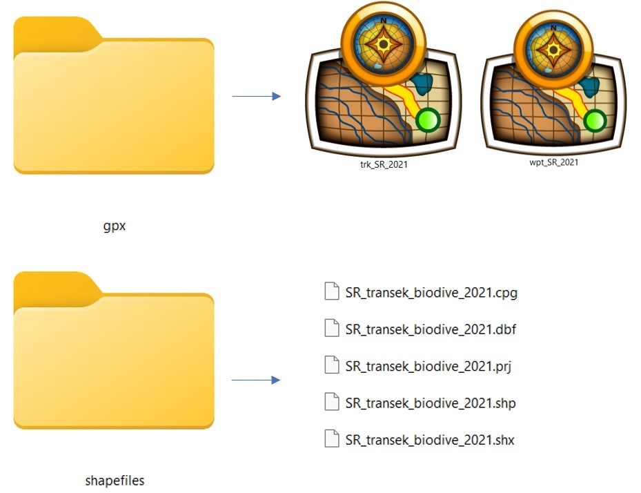

# Pengelolaan Data {-}

Pengelolaan data yang baik merupakan aspek yang penting dalam upaya konservasi, dengan adanya data yang terkelola dengan baik, potensi untuk kebermanfaatan yang lebih luas semakin teroptimalkan, seperti; menghasilkan analisa data yang holistik dan tepat guna, menjadi pembelajaran untuk perbaikan pada proyek berikutnya serta kolaborasi antar institusi. Oleh karena itu praktik terbaik dalam pengelolaan data adalah ketika data tersebut dapat disimpan serta didokumentasikan dengan benar sehingga dapat memfasilitasi untuk penggunaan di kemudian hari.

```{r foldering, echo=FALSE, out.width = '100%',fig.align='center',fig.cap='Keterkaitan antar jenis data'}
knitr::include_graphics("images/foldering.jpg")
```

Bab ini menyajikan rekomendasi pengelolaan data kehati yang dihasilkan oleh kajian survei kehati secara umum. Data kehati yang dihasilkan oleh FFI`s IP, umumnya menghasilkan 4 jenis data yaitu; data tabular, spasial, dokumentasi (foto/video) dan laporan hasil. Keempat data ini saling terkait satu sama lain sehingga struktur folder dan mekanisme penamaan data yang baku harus diterapkan agar fungsi dari ketiga ini dapat saling terkait. Deskripsi mengenai 4 folder utama pada gambar \@ref(fig:foldering) diatas adalah sbb;

## Data tabular {-}

Data tabular merupakan data utama dari kajian biodiversitas yang berisi temuan satwa dan informasi usaha survei. Contoh serta cara pengisian lembar data (_tally sheet_) yang digunakan dilapang dibahas lebih lengkap dalam [(Lampiran 1)](#lampiran-1.-lembar-data). Pada gambar \@ref(fig:folderingtabular) dibawah, terdapat minimal dua jenis data. Pertama dalam format pdf dari hasil pemindaian _tally sheet_, data ini merupakan sumber verifikasi utama ketika terdapat kesalahan dalam pemindahan ke format digital (xls). Kedua merupakan lembar data digital (_datasheet_) dalam format xls, berupa salinan _tally sheets_ sebagai data utama yang akan disimpan. Prinsip dari jenis data ini mampu dibaca baik oleh manusia, maupun komputer. Oleh karena itu, praktik terbaik dari suatu _datasheet_ adalah:

* Satu kolom hanya diisi satu jenis  data
* Konsistensi kolom; hanya berisi teks saja, angka saja atau tanggal saja. Tidak ada kolom yang bercampur
* Konsistensi penulisan; Format dan kategori yang digunakan selalu sama disetiap baris
* Hindari penggunaan spesial karakter seperti; @,$,* dan lainnya.
* Gunakan referensi kordinat WGS84 dengan format _decimal degree_ (contoh; 102.56548, -1.54862), supaya data kordinat dapat relevan lintas lanskap dan mudah dibaca oleh sistem 

```{r folderingtabular, echo=FALSE, out.width = '100%',fig.align='center',fig.cap='Komponen pada folder data tabular'}
knitr::include_graphics("images/folderingtabular.jpg")
```

Templat _datasheets_ yang dapat digunakan dalam kajian biodiversitas dapat diunduh melalui tautan berikut ini; [_Datasheet-biodive_](https://github.com/ryanavri/FFIP_surveikehati/tree/main/appendices/tallysheets). Setiap _datasheets_ memiliki 4 lembar utama berupa; 

1. Data perjumpaan. Lembar ini berisi informasi setiap temuan satwa.

2. Usaha survei. Lembar ini berisi informasi usaha survei dan *SSU*. Tab pertama dan kedua memastikan bahwa setiap kajian yang dilakukan memiliki usaha survei yang dapat diukur, sehingga analisa yang dilakukan dibandingkan dengan kajian yang lain secara terukur.

3. Deksripsi pengisian data. Lembar ini berupa informasi cara pengisian setiap kolom dalam lembar pertama dan kedua. Lembar ini dijadikan acuan dalam pengisian data dan memastikan penggunaan data yang konsisten, serta dapat diinterpretasikan dan di replikasi oleh orang lain di kemudian hari.

4. Informasi survei. Lembar ini berisi informasi kepemilikan data serta gambaran umum survei tersebut. Dengan adanya informasi ini, orisinalitas kepemilikan data melekat pada data tersebut.

Setelah kedua data tersebut terpenuhi, kontrol terhadap kualitas data juga harus dilakukan. Seringkali data-data yang dituliskan terjadi kesalahan seperti;

* Keliru dalam peletakan koma dari angka yang seharusnya 11,10 menjadi 111,0
* Kesalahan ejaan dalam penulisan nama latin, seperti 'Neofelis diardii', 'Neofelis diiardi', 'Neofelis diardi'. Dalam sistem komputer, ketiga nama tersebut akan terbaca menjadi tiga spesies berbeda.


## Dokumentasi (Foto/Video) {-}

Dokumentasi terpilih yang didapatkan dari kegiatan survei masuk ke dalam folder tersebut. Pada umumnya, terdapat dua sub-folder yang perlu ada yaitu aktivitas dan spesies. Folder aktivitas disusun hingga tingkat ke-3 berupa foto-foto terpilih mengenai aktivitas yang dilakukan oleh tim terkait survei. Penamaan foto / video ditulis sesuai dengan aktivitas yang dilakukan, folder ini memastikan seluruh foto dengan kualitas orisinal dapat tersimpan dengan baik serta narasi mengenai kegiatan yang dilakukan dapat tersimpan secara terstruktur (Gambar \@ref(fig:folderingdok)).

```{r folderingdok, echo=FALSE, out.width = '100%',fig.align='center',fig.cap='Komponen pada folder dokumentasi'}

```

Folder spesies disusun hingga tingkat ke-4 dengan tambahan sub-folder berupa nama spesies. Di dalam folder nama spesies tersebut disimpan seluruh foto baik perjumpaan langsung, maupun tanda keberadaan (contoh; cakaran beruang, tapak harimau, dll). Penamaan dari setiap foto harus sama dengan nama yang ditulis dalam _datasheet_ pada folder data tabular (Gambar \@ref(fig:folderingdoktab)). Praktik ini harus dilakukan untuk memastikan agar upaya verifikasi terhadap temuan spesies memungkinkan. _Human error_ dalam proses identifikasi bukanlah hal yang tidak mungkin terjadi, terlebih jika yang melakukan survei belum memiliki banyak pengalaman, sekaligus sebagai upaya identifikasi lebih lanjut jika belum dapat diidentifikasi hingga ke tingkat spesies.

```{r folderingdoktab, echo=FALSE, out.width = '100%',fig.align='center',fig.cap='Keterkaitan antara data tabular dengan dokumentasi'}

```

## Data spasial {-}

Folder ini berisi seluruh data spasial pendukung kegiatan survei. Folder utama yang perlu ada setidaknya adalah gpx dan shapefiles (Gambar \@ref(fig:folderingsp)). Folder gpx merupakan _backup_ dari data gps yang dipakai, baik untuk menyimpan data _waypoint_ maupun _track_. Data gpx dalam bentuk _waypoint_ digunakan untuk verifikasi kordinat yang tertulis dalam lembar data, sekaligus sebagai informasi tambahan untuk titik penting lainnya, sedangkan data _track_ diperlukan agar informasi terkait jalur dan rute survei dapat digunakan oleh tim lain jika terdapat pergantian personil, maupun oleh pemangku kepentingan lain jika dibutuhkan di kemudian hari. Data dari gps dapat dengan mudah dikelola serta dipindahkan antar perangkat (contoh; gps ke laptop, maupun sebaliknya) menggunakan perangkat lunak [_BaseCamp_](https://www.garmin.com/en-US/software/basecamp/).

```{r folderingsp, echo=FALSE, out.width = '100%',fig.align='center',fig.cap='Komponen pada folder data spasial'}

```

Folder shapefile utamanya berisi lokasi transek ataupun plot, dengan isian atribut tabel yang sama  pada _datasheet_ di lembar kedua (usaha survei / _Event sampling_) (Gambar \@ref(fig:folderingsp2)). Selain itu, data pendukung lainnya seperti batas kawasan, sungai, jalan dan informasi penting lainnya dalam area studi juga disarankan masuk kedalam folder tersebut.

```{r folderingsp2, echo=FALSE, out.width = '100%',fig.align='center',fig.cap='Keterkaitan antara data tabular dengan shapefiles dalam data spasial'}
knitr::include_graphics("images/folderingsp2.jpg")
```

## Laporan {-}

Seluruh laporan dari hasil kajian survei yang dilakukan, baik itu laporan tematis ataupun laporan utama disimpan dalam folder ini. Penamaan laporan dibuat dengan praktik sebagai berikut;

* Dibuat sesingkat mungkin namun tetap informatis
* Hindari kata yang berulang
* Hindari spesial karakter seperti; !@#$%^&*()`;<>?,[]{}'"|
* Menambahkan versi untuk memudahkan melacak perubahan seperti; laporan-mamalia-seko2021_02-12-21, laporan-mamalia-seko2021_25-12-21.
* Penambahan inisial pada akhir nama juga dapat ditambahkan bila diperlukan untuk melihat _reviewer_ terakhir seperti; laporan-mamalia-seko2021_25-12-21_FNT.

## Penyimpanan data {-}

Setelah 4 tahapan diatas dilakukan termasuk kontrol terhadap data, maka tahapan terakhir adalah menyimpan data final tersebut kedalam 3 lokasi berbeda sesegera mungkin, yaitu;

1. Secara lokal di _hard drive external_ pada _site_ atau wilayah kerja masing-masing, yang memang didedikasikan untuk penyimpanan final seluruh kegiatan.

2. Secara online pada akun personal OneDrive staf FFI`s IP yang ditunjuk sebagai wali data pada site tersebut.

3. Secara online dengan menghubungkan data tersebut pada akun OneDrive indonesia (indonesia@fauna-flora.org) dan mengirimkan email pemberitahuan pembaruan data pada email tersebut.

Poin pertama dilakukan untuk memastikan bahwa data yang tersimpan tidak hanya tersimpan pada laptop individual dan ada cadangan lokal pada _site_ tersebut. Poin kedua memastikan ada backup secara online, karena penyimpanan secara lokal memiliki resiko kehilangan data baik karena kerusakan maupun pencurian terhadadap infrastrukturnya. Terakhir pada poin ketiga, dilakukan untuk memastikan ada _backup_ secara nasional antar _site_ dan _project_. Hal ini juga dilakukan agar data nasional dapat di perbarui secara berkala, sehingga data tersebut dapat ditampilkan dalam sistem [visualisasi data FFI`s IP](https://ryanavri.shinyapps.io/FFI_Database/) yang dapat digunakan bagi fundraiser untuk strategi proposal, ataupun pengelola di pusat untuk membantu pelaporan kepada donor.