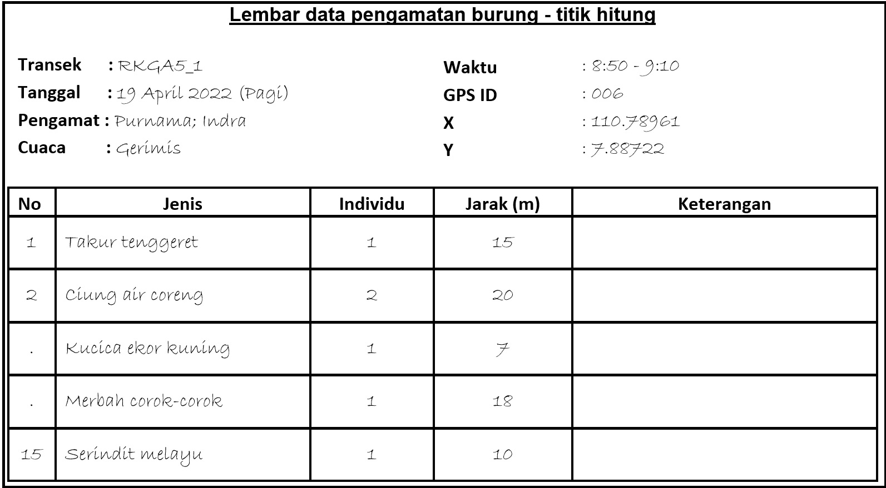
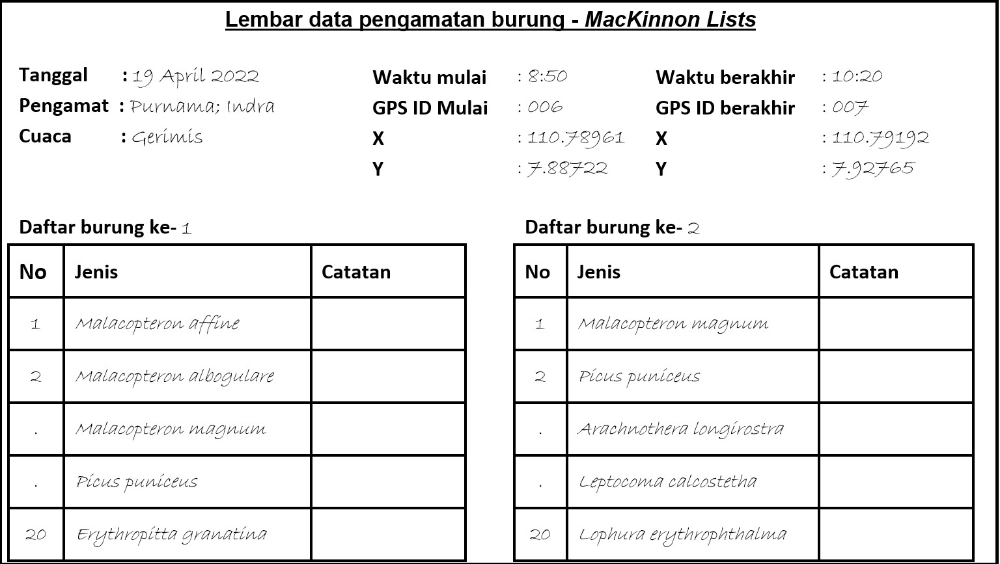

# Lampiran 1. Lembar Data {-}

Peran lembar data dalam kajian survei kehati sangat penting. Penggunaan lembar data yang tepat membuat pencatatan temuan menjadi lebih efisien dan terstandarisasi. Dalam lampiran ini terlampir contoh-contoh lembar data untuk setiap taksa. Templat lembar data tersedia pada tautan ini: _Tallysheet-biodive_. Pembaca bisa mengunduh dan memperbanyak lembar data sebanyak yang dibutuhkan sebelum survei. Pada praktiknya, mungkin lembar data yang penulis sediakan belum mencakup hal spesifik yang dibutuhkan oleh projek, oleh karena itu pembaca bisa menambahkan sendiri kolom-kolom yang dibutuhkan. 

Selalu gunakan pensil dalam menulis di lembar data dan jika memungkinkan gunakan kertas tahan air, karena kemungkinan basah karena hujan sangat tinggi. Setelah selesai dari lapang, harus langsung dipindai untuk disimpan sebagai salinan digital. Lembar data yang ditulis dilapangan ini merupakan data primer untuk verifikasi seandainya ada kesalahan input saat surveior memindahkan ke dalam excel.

## Lembar data avifauna {-}

**Lembar data pengamatan menggunakan titik hitung**

Pada awal lembar data dibutuhkan informasi umum mengenai tanggal, lokasi, durasi pengamatan, dan seluruh personil yang terlibat. Untuk lokasi geografis dari GPS, set menjadi decimal degree supaya bisa konsisten diseluruh Indonesia dan mudah di-input ke dalam sistem computer (Excel, dll). Keterangan dari setiap kolom adalah sebagai berikut;

**Jenis:** Nama jenis burung menggunakan nama latin, namun apabila belum mengetahui jenisnya, dapat menggunakan nama lokal terlebih dahulu.

**Individu:** Jumlah burung yang ditemukan pada satu spot (beberapa burung terkadang berkelompok atau berpasangan seperti cendrawasih atau burung gereja)

**Jarak:** Jarak burung dari pengamat dalam satuan meter

**Catatan:** Tambahan catatan penting jika ada

```{r ldpth, echo=FALSE, out.width = '75%',fig.align='center',fig.cap='Contoh lembar data untuk metode titik hitung'}

```

**Lembar data parameter lingkungan di titik hitung**

Dalam setiap titik hitung, dapat ditambahkan parameter lingkungan untuk melihat pengaruh perbedaan rona lingkungan terhadap komunitas burung, Adapun keterangan dari setiap baris adalah sebagai berikut

**Tallest tree (m):** Pohon tertinggi disekitar lokasi pengamatan. Satuan nilai dalam meter

**Ground cover (%):** Tutupan bawah disekitar lokasi pengamatan satuan nilai (%)

**Plant height 0-1,5 m (%):** Jumlah persentase pohon dengan ukuran 0-1.5 m disekitar lokasi pengamatan

**Plant height 1,5-5 m (%):** Jumlah persentase pohon dengan ukuran 1.5-5 m disekitar lokasi pengamatan

**Plant height 5-15 m (%):** Jumlah persentase pohon dengan ukuran 5-15 m disekitar lokasi pengamatan

**Plant height >15 m (%):** Jumlah persentase pohon dengan ukuran >15 m disekitar lokasi pengamatan

**Bole climb (%):** Persentase tumbuhan yang merambat disekitar lokasi pengamatan

**Liana (%):** Persentase tumbuhan pemanjat disekitar lokasi pengamatan

**Macaranga (%):** Persentase tumbuhan jenis macaranga disekitar lokasi pengamatan

**Rattan (%):** Persentase rotan disekitar lokasi pengamatan

**Fern (%):** Persentase paku-pakuan disekitar lokasi pengamatan

**Small palm (%):** Persentase palem-paleman disekitar lokasi pengamatan

**Dist. from water:** Kategori jarak ke sumber air; 1 = 0-50 m, 2 = 50-100m, 3 > 100m

**Logs abd:** Jumlah pohon tumbang yang ada dilokasi pengamatan

**Snags abd:** Jumlah pohon mati berdiri disekitar lokasi pengamatan

**Zingiberaceae (%):** Persentase temu-temuan/rimpang disekitar lokasi pengamatan

**Grass (%):** Persentase rumput-rumputan disekitar lokasi pengamatan

**Moss (cm):** Ketebalan lumut disekitar lokasi pengamatan dalam centimeter

**Litter (cm):** Ketebalan seresah disekitar lokasi pengamatan dalam centimeter


```{r ldppl, echo=FALSE, out.width = '75%',fig.align='center',fig.cap='Contoh lembar data untuk parameter lingkungan di setiap titik hitung'}
knitr::include_graphics("images/ldp_pl.jpg")
```

**Lembar data daftar jenis MacKinnon**

Pada pengamatan yang bersifat ekploratif menggunakan daftar jenis MacKinnon, lembar data yang digunakan sangat sederhana, dengan diawali informasi pengamat, lokasi dan durasi pengamatan

```{r ldpml, echo=FALSE, out.width = '75%',fig.align='center',fig.cap='Contoh lembar data untuk daftar jenis MacKinnon'}

```

