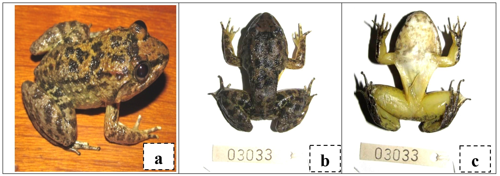

# Lampiran 2. Teknik Preservasi Spesimen {-}

Seringkali spesies yang ditemukan saat pengamatan belum bisa teridentifikasi hingga ke tingkat _species_. Ketika hal ini terjadi, umumnya pengamat harus menangkap jenis tersebut untuk diawetkan sebagai spesimen awetan (_voucher specimens_). Hal ini menjadi penting untuk dilakukan karena: (1) Memastikan identifikasi jenis secara akurat dan, (2) Meningkatkan pemahaman terhadap kemungkinan variasi jenis dari lokasi yang berbeda. Pengawetan spesimen ini juga dapat digunakan dikemudian hari oleh peneliti lain seperti studi DNA, revisi taksonomi dan sebagainya.

Meskipun penting untuk dilakukan, perlu diperhatikan juga mengenai etika dalam pengumpulan jenis. Beberapa kawasan konservasi mungkin membutuhkan legalitas yang harus diurus sebelum dapat membawa spesimen keluar kawasan. Ketika dikawasan non-konservasi pun kita harus sadar terhadap kerentanan spesies tersebut dan dampak yang akan terjadi terhadap pengambilan hewan untuk dijadikan spesimen awetan. Jika anda menangkap dan membunuh banyak hewan untuk alasan penelitian, justru menimbulkan dampak yang negatif terhadap upaya konservasi yang sedang anda upayakan. Oleh karena itu, perijinan untuk pengambilan spesimen dan tempat penyimpanan spesimen (laboratorium zoologi atau herbarium di universitas terdekat) harus didapatkan terlebih dahulu sebelum melakukan kajian, supaya hewan yang sudah ditangkap tidak mati sia-sia dan dapat digunakan sebaik-baiknya untuk penelitian.


## Herpetofauna {-}
Data yang diperlukan pada spesimen awetan herpetofauna harus memiliki catatan nama jenis, lokasi pengambilan sampel, tanggal dan waktu, kode sampel, berat, ukuran panjang, dan hal lain yang terkait. 

**Tahapan pengawetan:**

* Untuk keamanan gunakan sarung tangan lateks dan masker saat melakukan kegiatan preservasi. 
* Lakukan pembiusan dengan  menekan kapas yang sebelumnya telah dicelupkan ke cairan MS-222 atau Chlorobutanol pada lubang pernafasan. Saat larutan MS-222 atau Chlorobutanol tidak dapat diperoleh maka dapat diganti dengan larutan alkohol 70%.
* Setelah dipastikan sampel terbius (terlihat lemas), lakukan penyuntikkan alcohol 70% menggunakan _syringe_ pada otak kecil melalui tengkuk.
* Lakukan penyuntikan formalin 10% pada bagian-bagian berdaging, berongga dan organ dalam.
* Segera setelah penyuntikkan, letakkan sampel tersebut dalam suatu kotak plastik yang sebelumnya telah dilapisi kain kasa dan dibasahi oleh larutan formalin 10%.
* Atur posisi spesimen dengan posisi menunjukkan morfologi spesimen terlihat untuk memudahkan identifikasi ulang di laboratorium jika dibutuhkan. Misalnya mulut disumpal dengan kapas untuk menunjukkan bagian dalam mulut, jari-jari tungkai dimekarkan untuk melihat selaput (gambar \@ref(fig:spesamf1)). Kemudian ikatkan label pada bagian pinggang agar tidak tertukar dengan spesimen lain.
*  Tutupi spesimen dengan kain yang dibasahi formalin 10% dan tutup box selama satu sampai dua hari hingga spesimen kaku.
* Untuk penyimpanan permanen, spesimen yang telah dipreservasi dalam kotak plastik dikeluarkan dan dibilas dengan air mengalir selama 1 – 2 jam untuk menghilangkan sisa formalin. Setelah itu dapat dipindahkan ke dalam toples kaca yang berisi alkohol 70%

```{r spesamf1, echo=FALSE, out.width = '100%',fig.align='center',fig.cap='Foto spesimen Amfibi; bagian lateral (a), bagian dorsal (b), bagian ventral (c).'}

```

```{r spesamf2, echo=FALSE, out.width = '100%',fig.align='center',fig.cap='Spesimen Amfibi yang telah diatur posisinya dan diberi label spesimen untuk memudahkan identifikasi ulang di laboratorium'}
knitr::include_graphics("images/spesimenafmibi2.jpg")
```

## Mamalia {-}
Pengawetan satwa mamalia kecil dan kelelawar untuk identifikasi lebih lanjut atau koleksi spesimen adalah sebagai berikut:

* Lakukan pembiusan dengan  menekan kapas yang sebelumnya telah dicelupkan ke cairan klorofom atau alkohol 70% 
* Setelah dipastikan sampel terbius (terlihat lemas), lakukan penyuntikkan alcohol 70% menggunakan _syringe_ pada otak kecil melalui tengkuk.
* Lakukan pengambilan foto sebagai dokumentasi warna asli sebelum diawetkan
* Sumbat mulut dengan kapas, supaya bagian mulut dapat diperiksa sebelum kaku dikemudian hari, lalu lakukan penyuntikan formalin 5-10% pada bagian-bagian berdaging, berongga dan organ dalam.
* Letakkan sampel tersebut ke dalam suatu kotak plastik yang sebelumnya telah dilapisi kain kasa dan dibasahi oleh larutan formalin 10%, kemudian ikatkan label pada bagian kaki agar tidak tertukar dengan spesimen lain
* Untuk penyimpanan permanen, spesimen yang telah dipreservasi dalam kotak plastik dikeluarkan dan dibilas dengan air mengalir selama 1 – 2 jam untuk menghilangkan sisa formalin. Setelah itu dapat dipindahkan ke dalam toples kaca yang berisi alkohol 70%

## vegetasi {-}
